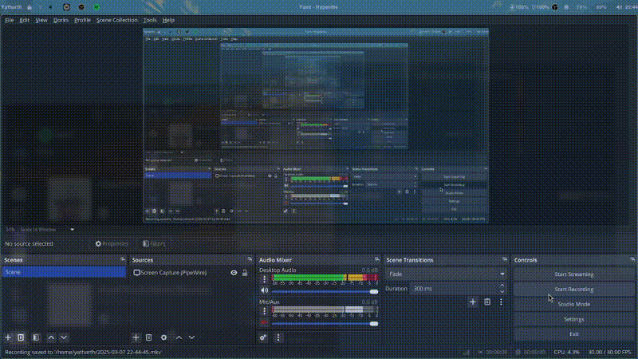

# Hyprland Rice 🚀✨🎨

Welcome to my Hyprland rice setup! I use Arch, btw. This is a custom Linux desktop environment built for speed, simplicity, and a polished aesthetic. If you love tinkering with your setup and want your desktop to look and feel just right, you’re in the right place. 🌿


## Repository 📂🔗

[**GitHub Repository**](https://github.com/former-pokemon/Hyprland-rice)

## Features 🖥️⚡🎯

- **Window Manager:** Hyprland — dynamic tiling, lightweight, and ridiculously customizable
- **Status Bar:** Waybar — flexible and easy to style with CSS
- **Terminal Emulator:** Kitty — GPU-accelerated and fast as hell
- **Application Launcher:** Rofi — minimal, fast, and super scriptable
- **Notification Daemon:** Swaync — simple, lightweight, and just works
- **File Manager:** Thunar — reliable and easy to use
- **Compositor & Effects:** Hyprland's built-in effects (blur, shadows, animations)
- **Wallpaper Manager:** Swww — lightweight and smooth wallpaper handling

## Installation 🛠️📥🖱️

1. Clone the repository:

```bash
git clone https://github.com/former-pokemon/Hyprland-rice
cd Hyprland-rice
```

2. Copy the configuration files to your `.config` directory:

```bash
cp -r .config/* ~/.config/
```

3. Reload Hyprland or log out and log back in to see the changes. 🔄

## Theming & Styling 🎨🖌️✨

I went for a modern, minimal with vibrant accents. The CSS files for Waybar and GTK themes are fully customizable, so tweak them to your heart’s content.

Example Waybar styling:

```css
/* Waybar styles */
#waybar {
    background: rgba(0, 0, 0, 0.8);
    border-radius: 10px;
    padding: 6px;
    color: #cdd6f4;
    font-family: 'JetBrains Mono', monospace;
}

#clock {
    font-weight: bold;
    color: #89b4fa;
    font-size: 14px;
}
```

It’s your rice, so make it yours, after all. 🧑‍🎨

## Showcase 🎥



 
With audio: 
[](https://youtu.be/lkBbZEdpgg8)

Or click the link: [https://youtu.be/lkBbZEdpgg8](https://youtu.be/lkBbZEdpgg8)


## Future Enhancements 🚧🔧📘

- A detailed list of keybindings
- Wallpaper rotation scripts
- System monitoring widgets for Waybar

## Contributing & Support 🫂💡📩

Got ideas or found a bug? Open an issue or fork the repo!

- **GitHub Issues:** For bug reports and feature requests
- **Email:** yathubhai5612@gmail.com

Happy ricing! 🎉🌈🔑

---

_Made with love, late nights, and way too many terminal windows. 🚀💻🧠_

